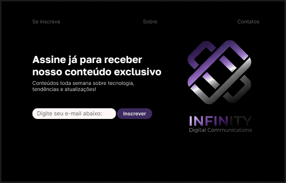

# infinity-newsletter

Um mini projeto de template de **newsletter** apenas para fins de treinamento de estilização. O objetivo é fornecer uma interface interativa e visualmente facil de entender para o envio de boletins informativos a assinantes.

## Tecnologias utilizadas

- **HTML5**: Estrutura do conteúdo.
- **CSS3**: Estilo visual.

## Design

O design foi criado no **Figma**, focando em uma interface limpa, intuitiva e visualmente moderna.  Foi criado o código HTML e CSS exatamente como feito no figma apenas olhando e reproduzindo igual. E também mantendo a experiência do usuário (UX) e a estética visual (UI).
